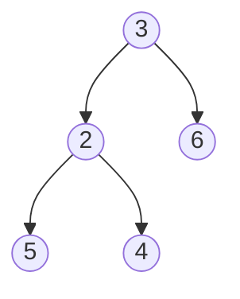

在二叉树中找出和为某一值的所有路径：
输入一个整数和一棵二元树。从树的根结点开始往下访问，一直到叶结点所经过的所有结点形成一条路径。打印出和与输入整数相等的所有路径。例如，输入整数 9 和如下二元树：


则打印出两条路径：3，6 和 3，2，4。

```c++
#include <string>

struct stNode
{
	stNode(int value)
	:value(value)
	,pLeft(nullptr)
	,pRight(nullptr)
	{
	}

	int value;
	stNode* pLeft;
	stNode* pRight;
};

class CPathOfTree
{
public:
	void getPathOfBTree(int num, stNode* tree)
	{
		pathOfBTree(num, tree, "");
	}

	void pathOfBTree(int num, stNode* tree, std::string path)
	{
		if (tree == nullptr || tree->value > num)
		{
			return;
		}
		if (tree->pLeft == nullptr && tree->pRight == nullptr && tree->value == num)
		{
			std::string out = path + std::to_string(tree->value);
			printf("\033[0;35m""%s""\033[0m\n", out.c_str());
			return;
		}
		//std::to_string(num)
		pathOfBTree(num - tree->value, tree->pLeft, path + std::to_string(tree->value) + " ");
		pathOfBTree(num - tree->value, tree->pRight, path + std::to_string(tree->value) + " ");
	}
};

int main(int argc, char const *argv[])
{
	stNode* n1 = new stNode(3);
	stNode* n2 = new stNode(2);
	stNode* n3 = new stNode(6);
	stNode* n4 = new stNode(5);
	stNode* n5 = new stNode(4);

	n1->pRight = n3;
	n1->pLeft = n2;
	n2->pRight = n5;
	n2->pLeft = n4;

	CPathOfTree a;

	a.getPathOfBTree(9,n1);
	return 0;
}
```