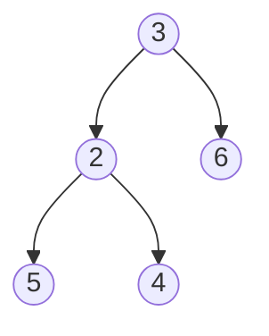

在二叉树

# 二叉树中是否存在某个路径和
二叉树中是否有和为某一值的所有路径（路径的起点必须是二叉树的根节点，终点必须是叶子节点）：
```c++
#include <string>
#include <stack>
struct stNode
{
	stNode(int value)
	:value(value)
	,pLeft(nullptr)
	,pRight(nullptr)
	{
	}

	int value;
	stNode* pLeft;
	stNode* pRight;
};

class CPathOfTree
{
public:

	bool hasPathSum(stNode* root, int sum)
	{
		if (root == nullptr)
			return false;
		int val = root->value;
		if (root->pLeft == nullptr && root->pRight == nullptr && val == sum)
			return true;
		return hasPathSum(root->pLeft, sum - val) || hasPathSum(root->pRight, sum - val);
	}
};

int main(int argc, char const *argv[])
{
	stNode* n1 = new stNode(3);
	stNode* n2 = new stNode(2);
	stNode* n3 = new stNode(6);
	stNode* n4 = new stNode(5);
	stNode* n5 = new stNode(4);

	n1->pRight = n3;
	n1->pLeft = n2;
	n2->pRight = n5;
	n2->pLeft = n4;

	CPathOfTree a;

	int ret = a.hasPathSum(n1, 9);
	printf("\033[0;35m""ret = %d""\033[0m\n", ret);
	return 0;
}
```
```c++
#include <string>
#include <stack>
struct stNode
{
	stNode(int value)
	:value(value)
	,pLeft(nullptr)
	,pRight(nullptr)
	{
	}

	int value;
	stNode* pLeft;
	stNode* pRight;
};

class CPathOfTree
{
public:

	bool hasPathSum_iteration(stNode* root, int sum)
	{
		if (root == nullptr)
			return false;
		std::stack<stNode*> stk;
		std::stack<int> path;
		
		stk.push(root);
		path.push(root->value);
		
		while (!stk.empty())
		{
			stNode* t = stk.top();
			stk.pop();
			int val = path.top();
			path.pop();

			if (t->pLeft == nullptr && t->pRight == nullptr && sum == val)
			{
				return true;
			}
			if (t->pLeft != nullptr)
			{
				stk.push(t->pLeft);
				path.push(val + t->pLeft->value);
			}
			if (t->pRight != nullptr)
			{
				stk.push(t->pRight);
				path.push(val + t->pRight->value);
			}
		}
		return false;
	}
};

int main(int argc, char const *argv[])
{
	stNode* n1 = new stNode(3);
	stNode* n2 = new stNode(2);
	stNode* n3 = new stNode(6);
	stNode* n4 = new stNode(5);
	stNode* n5 = new stNode(4);

	n1->pRight = n3;
	n1->pLeft = n2;
	n2->pRight = n5;
	n2->pLeft = n4;

	CPathOfTree a;

	int ret = a.hasPathSum_iteration(n1, 9);
	printf("\033[0;35m""ret = %d""\033[0m\n", ret);
	return 0;
}

```
# 列出所有满足给定路径和的路径
在二叉树中找出和为某一值的所有路径：
输入一个整数和一棵二元树。从树的根结点开始往下访问，一直到叶结点所经过的所有结点形成一条路径。打印出和与输入整数相等的所有路径。例如，输入整数 9 和如下二元树：


则打印出两条路径：3，6 和 3，2，4。
```c++
//递归方法，时间复杂度O(n)，n为节点数, 空间复杂度O(h)，h为树高度
#include <string>

struct stNode
{
	stNode(int value)
	:value(value)
	,pLeft(nullptr)
	,pRight(nullptr)
	{
	}

	int value;
	stNode* pLeft;
	stNode* pRight;
};

class CPathOfTree
{
public:
	void getPathOfBTree(int num, stNode* tree)
	{
		pathOfBTree(num, tree, "");
	}

	void pathOfBTree(int num, stNode* tree, std::string path)
	{
		if (tree == nullptr || tree->value > num)
		{
			return;
		}
		if (tree->pLeft == nullptr && tree->pRight == nullptr && tree->value == num)
		{
			std::string out = path + std::to_string(tree->value);
			printf("\033[0;35m""%s""\033[0m\n", out.c_str());
			return;
		}
		//std::to_string(num)
		pathOfBTree(num - tree->value, tree->pLeft, path + std::to_string(tree->value) + " ");
		pathOfBTree(num - tree->value, tree->pRight, path + std::to_string(tree->value) + " ");
	}
};

int main(int argc, char const *argv[])
{
	stNode* n1 = new stNode(3);
	stNode* n2 = new stNode(2);
	stNode* n3 = new stNode(6);
	stNode* n4 = new stNode(5);
	stNode* n5 = new stNode(4);

	n1->pRight = n3;
	n1->pLeft = n2;
	n2->pRight = n5;
	n2->pLeft = n4;

	CPathOfTree a;

	a.getPathOfBTree(9,n1);
	return 0;
}
```
```c++
//使用栈，时间复杂度O(n)，n为节点数, 空间复杂度O(h)，h为树高度
#include <string>
#include <stack>
struct stNode
{
	stNode(int value)
	:value(value)
	,pLeft(nullptr)
	,pRight(nullptr)
	{
	}

	int value;
	stNode* pLeft;
	stNode* pRight;
};

class CPathOfTree
{
public:
	void getPathOfBTree(int num, stNode* tree)
	{
		pathOfBTree(num, tree);
	}

	int maxDepth(stNode *root)
	{
		if (root == nullptr)
			return 0;
		if (root->pRight == nullptr && root->pLeft == nullptr)
			return 1;
		if (root->pRight == nullptr)
			return maxDepth(root->pLeft) + 1;
		if (root->pLeft == nullptr)
			return maxDepth(root->pRight) + 1;
		return std::max(maxDepth(root->pLeft), maxDepth(root->pRight)) + 1;
	}

	bool pathOfBTree(int num, stNode* tree)
	{
		if (tree == nullptr || tree->value > num)
		{
			return false;
		}
		int npath[maxDepth(tree)];
		std::stack<stNode*> stk;
		std::stack<int> level;
		std::stack<int> path_sum;
		stk.push(tree);
		level.push(0);
		path_sum.push(tree->value);
		
		while (!stk.empty())
		{
			stNode* t = stk.top();
			stk.pop();
			int curlevel = level.top();
			level.pop();
			int val = path_sum.top();
			path_sum.pop();

			npath[curlevel] = t->value;
			if (t->pLeft == nullptr && t->pRight == nullptr && val == num)
			{
				printf("\033[0;35m");
				for (int i = 0; i <= curlevel; i++)
				{
					printf("%d", npath[i]);
				}
				printf("\033[0m\n");
			}

			if (t->pLeft != nullptr)
			{
				stk.push(t->pLeft);
				path_sum.push(val + t->pLeft->value);
				level.push(curlevel+1);
			}
			if (t->pRight != nullptr)
			{
				stk.push(t->pRight);
				path_sum.push(val + t->pRight->value);
				level.push(curlevel+1);
			}
		}
		return false;
	}
};

int main(int argc, char const *argv[])
{
	stNode* n1 = new stNode(3);
	stNode* n2 = new stNode(2);
	stNode* n3 = new stNode(6);
	stNode* n4 = new stNode(5);
	stNode* n5 = new stNode(4);

	n1->pRight = n3;
	n1->pLeft = n2;
	n2->pRight = n5;
	n2->pLeft = n4;

	CPathOfTree a;

	a.getPathOfBTree(9,n1);
	return 0;
}
```